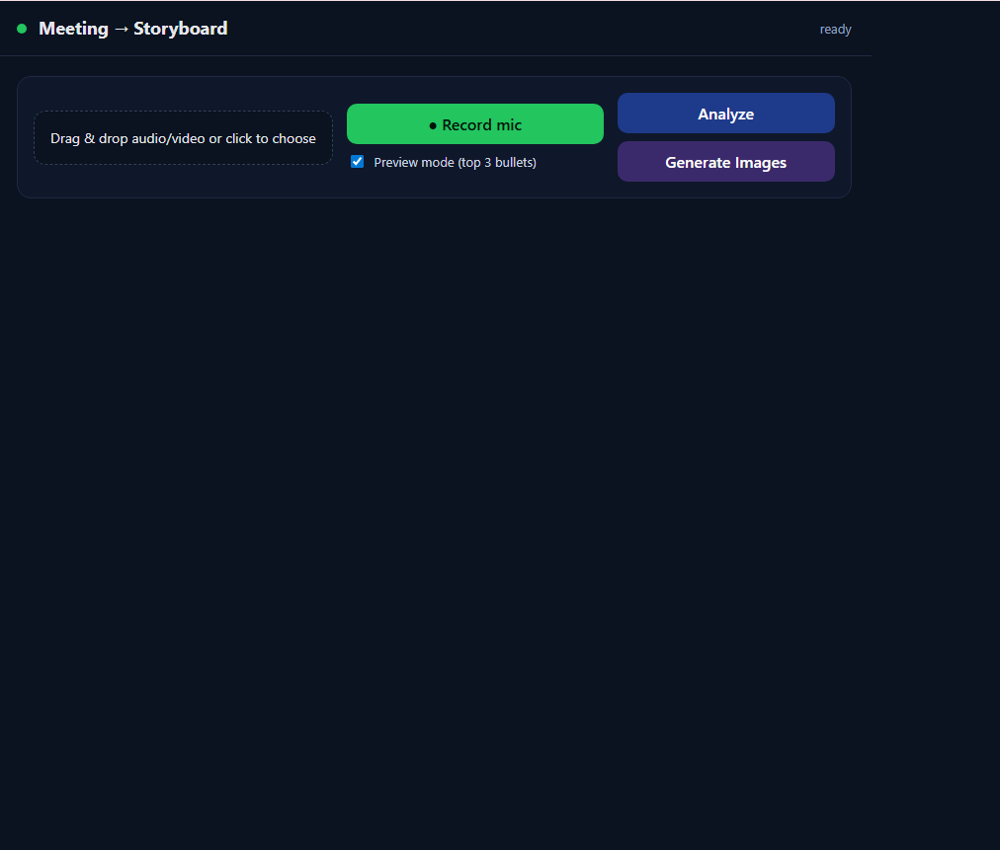
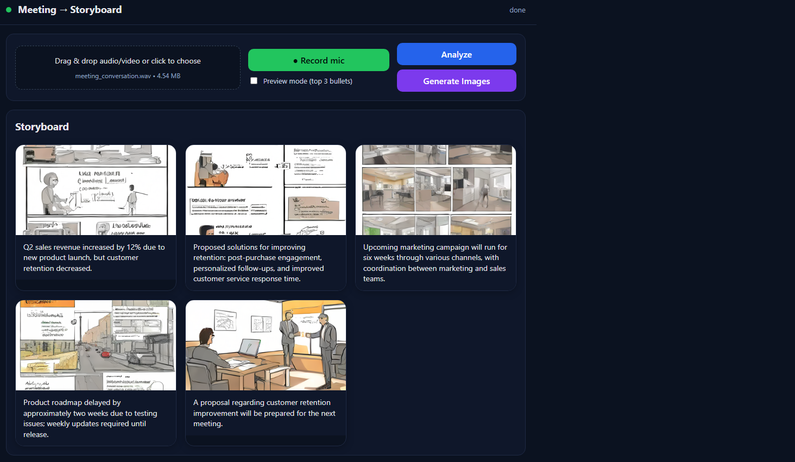

# 🎯 Meeting → Storyboard

An end-to-end web application that:
- Transcribes meeting audio/video using Whisper.cpp.
- Summarizes into concise bullet points via Ollama.
- Generates visual storyboards using Stable Diffusion.
- Displays results in a modern React-based UI.

---

## 📌 Features
- 🎤 **Audio/Video Upload** or Record via Mic
- ✍ **Automatic Transcription** (Whisper.cpp)
- 📑 **Summarization** into bullet points (Ollama LLM)
- 🖼 **Image Generation** for each bullet point (Stable Diffusion)
- 💻 **Modern Frontend** built with React + Vite
- ⚡ **FastAPI Backend** for processing

---

## 🏗 Architecture

```plaintext
         ┌──────────────┐
         │   Frontend   │ (React + Vite)
         │              │
         └──────┬───────┘
                │ Upload Audio/Video
                ▼
         ┌──────────────┐
         │   Backend    │ (FastAPI)
         │              │
         ├──────┬───────┤
         │      │       │
  Transcription Summarization
   (Whisper.cpp)   (Ollama LLM)
         │              │
         └──────┬───────┘
                ▼
         ┌──────────────┐
         │ Image Gen    │ (Stable Diffusion)
         └──────┬───────┘
                ▼
         ┌──────────────┐
         │  Storyboard  │
         │  Display UI  │
         └──────────────┘
```

---

## 🚀 Setup Instructions

```bash
# Clone the repository
git clone https://github.com/kudos07/EchoFrames.git
cd EchoFrames

# -------------------
# Backend Setup
# -------------------
cd backend
pip install -r requirements.txt

# Run the backend
uvicorn main:app --reload &

# -------------------
# Frontend Setup
# -------------------
cd ../frontend
npm install

# Run the frontend
npm run dev
```

Open the app at: **http://localhost:5173**

---

## 🔍 How It Works
1. **Upload / Record Audio**
   - Drag & drop audio/video file or record via mic.
2. **Transcription**
   - Whisper.cpp converts speech to text.
3. **Summarization**
   - Ollama processes transcript into concise bullet points.
4. **Image Generation**
   - Stable Diffusion creates visuals for each bullet point.
5. **Storyboard Display**
   - React frontend shows images + text in a clean layout.

---


## 🎨 Customization & Image Quality Tips

To improve the generated images and make them more relevant to your audio content:

### 1️⃣ Provide Clear, Context-Rich Audio
- Use high-quality recordings with minimal background noise.
- Ensure each speaker talks clearly and stays on-topic.
- Meetings with structured discussions produce more accurate summaries and visuals.

### 2️⃣ Adjust Image Generation Hyperparameters
In `cli_storyboard.py` (or wherever image generation is triggered), experiment with:
- **`num_inference_steps`** – Higher values (e.g., 30–50) improve detail but increase generation time.
- **`guidance_scale`** – Controls adherence to the prompt.
  - Lower (~5) = more creative, less literal.
  - Higher (~8–12) = more literal, closer to summary text.
- **Image size** – Default is `512x512`; increasing resolution (e.g., `768x768`) can improve quality, but requires more GPU memory.

### 3️⃣ Prompt Engineering for Better Context
- You can prepend extra context to the bullet points before sending them to the image generation model.
- Example : "A professional corporate meeting scene: " + bullet_point

This improves thematic consistency.

### 4️⃣ Enable Full Mode vs Preview Mode
- **Preview Mode**: Only top 3 bullet points are processed — faster.
- **Full Mode**: All bullet points processed for a richer storyboard.

---

💡 *Pro Tip*: If the generated images feel too generic, try editing the summarization prompt in the backend to produce more vivid, descriptive bullet points.

---

## 📦 Tech Stack
- **Frontend**: React, Vite, TailwindCSS
- **Backend**: FastAPI, Python
- **Speech-to-Text**: Whisper.cpp
- **LLM Summarization**: Ollama
- **Image Generation**: Stable Diffusion
- **Package Manager**: npm, pip

---

## 📸 Sample Output






---

## 📝 License
This project is licensed under the MIT License.
